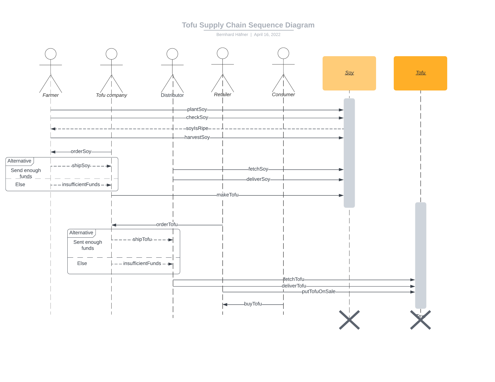
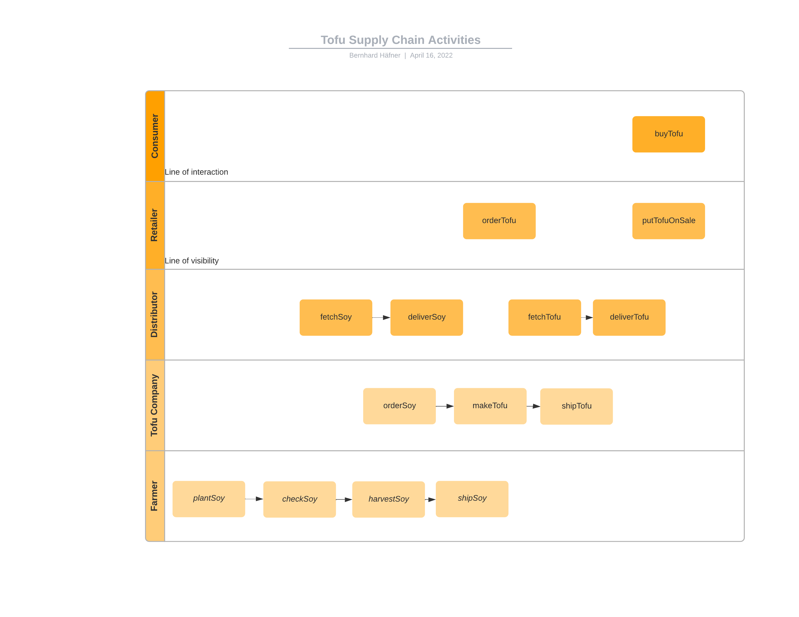
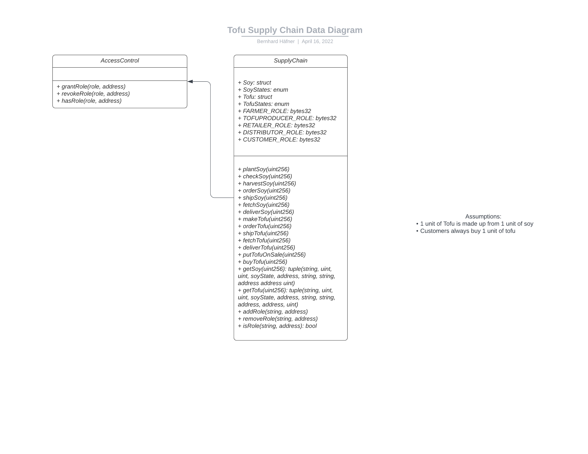
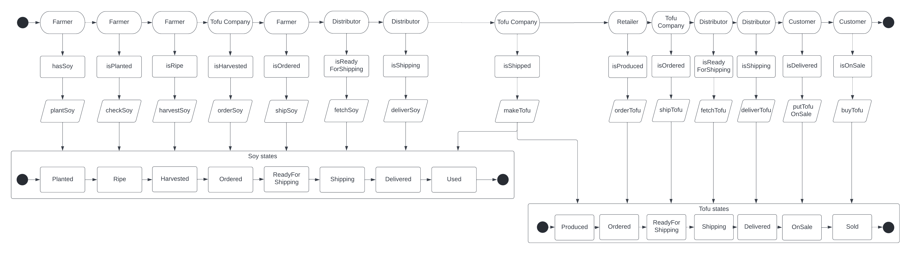

# Tofu Supply Chain tracking on the Blockchain

This repository is my solution to the third project of the Udacity "Blockchain Developer" Nanodegree.

## What problem does this application solve? 

This repository enables tracking soy from a farmer up to the final customer via a tofu company, distributor, and retailer. This enables consistent tracking of goods and reliable, transparent information about the origin of the product the customers hold in their hands.

The contract is deployed on the Rinkeby network with address [0x1a23755972D82D1D77329d81A58C7e92F17aF4D3](https://rinkeby.etherscan.io/address/0x1a23755972D82D1D77329d81A58C7e92F17aF4D3). 

## Dependencies

- npm: 8.5.0 (Use `npm -v`)
- Truffle v5.5.7 (core: 5.5.7)
- Ganache v^7.0.3
- Solidity v0.8.13 (solc-js, set in `truffle-config.js`)
- Node v16.14.2 (Use `node -v`)
- Web3.js v1.7.3
- Metamask: v10.12.3

Dependencies as listed in `package.json`:
- "@openzeppelin/contracts": "^4.5.0", for the `AccessControl` contract
- "@truffle/hdwallet-provider": "^2.0.6", for wallet integration
- "bignumber.js": "^9.0.2", for correctly calculating with big numbers
- "web3-eth": "^1.7.3", for web3 integration
- "web3-utils": "^1.7.3" for web3 integration

## Understanding the code
- `contracts/TofuSupplyChain.sol`: the smart contract that encompasses everything from role management to functions for producing, ordering, shipping, and buying stuff on the supply chain
- `tests/TestSupplyChain.js`: the test cases
- `app/src/index.js` and `app/src/index.html`: the code for the frontend.

## Run the application

1. Clean the frontend: 
```bash
cd app
# Remove the node_modules  
# remove packages
rm -rf node_modules # Not necessary in case you cloned this repo, as app/node_modules is in .gitignore
# clean cache
npm cache clean # Not necessary in current version of npm
rm package-lock.json
# initialize npm (you can accept defaults)
npm init
# install all modules listed as dependencies in package.json
npm install
```

2. Start ganache: `ganache-cli` (Check whether port is identical with the one in `truffle-config.js`)

3. Set up and start Truffle by running (in the root directory): 
```bash
npm init
npm install
cp <path to your mnemonic> ./.secret # Copy your mnemonic in a separate file and name it .secret
truffle migrate --reset --network development
truffle test # Should give you 15 passing tests
```

4. Start frontend:
```bash
cd app
npm run dev
```

Then open the shown address (probably http://localhost:8080/) in you browser and log into MetaMask (maybe you have to import an account from the development network) to interact with the smart contract.


## UML Diagrams about the DApp

### Sequence diagram



### Activities diagram



### Data diagram



### State diagram


