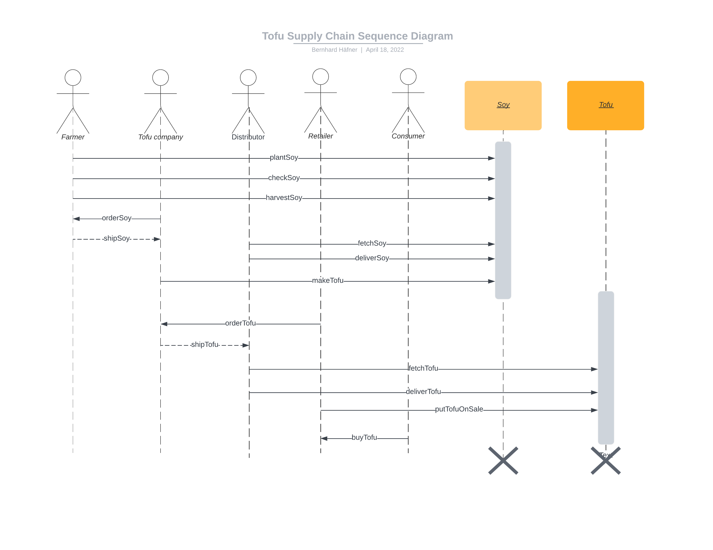
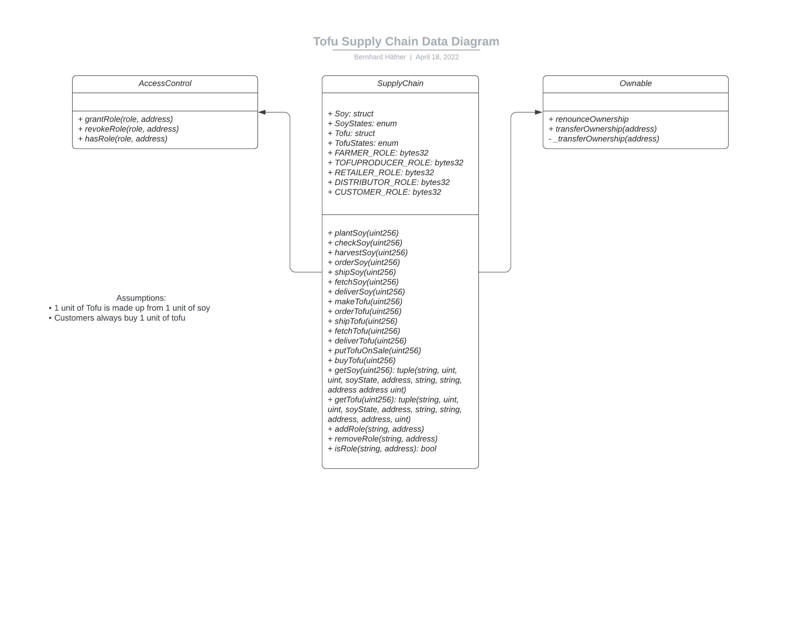

# Supply Chain tracking on the Blockchain
Project version 1.0

This repository is my solution to the third project of the Udacity "Blockchain Developer" Nanodegree.

As we did get encouraged to use our own example supply chain as example, I chose a tofu supply chain with two products, soy and tofu. After having implemented the project according to the project rubric, I saw that in the project's concepts, Udacity specifically ask to use their project starter code with exactly a coffee supply chain example. Therefore, I adapted my code to reflect the structure and elements of the coffee example code (e.g., emitting events in the functions and testing them with truffle-assertions). I hope that, while the project still doesn't use the example starter code as basis, I still sufficiently showed understanding of the concepts of this lesson. I made sure that the code checks all boxes in the project rubric and implements all functionality from the project starter code. I also test all the functions from the sequence diagram plus additionally whether the role assignment works correctly. The only deviation is that, as I built it from scratch, the code doesn't use OpenZeppelin's `Roles` library (which has been removed at the upgrade from OpenZeppelin v2.5.x to v3.x), but instead relies on their relatively new `AccessControl.sol` contract which can achieve the same functionality (see [here](https://betterprogramming.pub/how-to-use-openzeppelins-new-accesscontrol-contract-5b49a4bcd160) for a guide comparing the two and [here](https://docs.openzeppelin.com/contracts/4.x/access-control) for the official documentation) without the need to define each role within a separate inheritance contract, making the code much more easy to understand and maintain. Via `AccessControl`, I only had to define role hashes and `addRole`, `removeRole`, and `isRole` functions within `TofuSupplyChain.sol` once, which makes the code much clearer and less cluttered, in my opinion.

## What problem does this application solve? 

This repository enables tracking soy from a farmer up to the final customer via a tofu company, distributor, and retailer. This enables consistent tracking of goods and reliable, transparent information about the origin of the product the customers hold in their hands.

The contract is deployed on the Rinkeby network with address [0x1a23755972D82D1D77329d81A58C7e92F17aF4D3](https://rinkeby.etherscan.io/address/0x1a23755972D82D1D77329d81A58C7e92F17aF4D3). 

## Dependencies

- npm: 8.5.0 (Use `npm -v`)
- Truffle v5.5.7 (core: 5.5.7)
- Ganache v^7.0.3
- Solidity v0.8.13 (solc-js, set in `truffle-config.js`)
- Node v16.14.2 (Use `node -v`)
- Web3.js v1.7.3
- Metamask: v10.12.3

Dependencies as listed in `package.json`:
- "@openzeppelin/contracts": "^4.5.0", for the `AccessControl` contract
- "@truffle/hdwallet-provider": "^2.0.6", for wallet integration
- "bignumber.js": "^9.0.2", for correctly calculating with big numbers
- "truffle-assertions": "^0.9.2", for testing whether events are emitted, correctly
- "web3-eth": "^1.7.3", for web3 integration
- "web3-utils": "^1.7.3" for web3 integration

## Understanding the code
- `contracts/TofuSupplyChain.sol`: the smart contract that encompasses everything from role management to functions for producing, ordering, shipping, and buying stuff on the supply chain
- `tests/TestSupplyChain.js`: the test cases
- `app/src/index.js` and `app/src/index.html`: the code for the frontend.

I did not use IPFS to host the application in a decentralized fashion.

## Run the application

1. Clean the frontend: 
```bash
cd app
# Remove the node_modules  
# remove packages
rm -rf node_modules # Not necessary in case you cloned this repo, as app/node_modules is in .gitignore
# clean cache
npm cache clean # Not necessary in current version of npm
rm package-lock.json
# initialize npm (you can accept defaults)
npm init
# install all modules listed as dependencies in package.json
npm install
```

2. Start ganache: `ganache-cli` (Check whether port is identical with the one in `truffle-config.js`)

3. Set up and start Truffle by running (in the root directory): 
```bash
npm init
npm install
cp <path to your mnemonic> ./.secret # Copy your mnemonic in a separate file and name it .secret
truffle migrate --reset --network development
truffle test # Should give you 15 passing tests
```

4. Start frontend:
```bash
cd app
npm run dev
```

Then open the shown address (probably http://localhost:8080/) in you browser and log into MetaMask (potentialy you have to import an account from the development network) to interact with the smart contract.


## UML Diagrams about the DApp

### Sequence diagram



### Activities diagram


### Data diagram




### State diagram


## Screenshots of the frontend 

On the top, you can enter the information about soy and tofu you currently handle, and you can assign roles:


Below this, you can perform all the actions of the different roles (most refer to the 'Soy UPC' and 'Tofu UPC' field on top of the page):


In the bottom, you find the validation fields to request information on a specific (soy or tofu) UPC:

